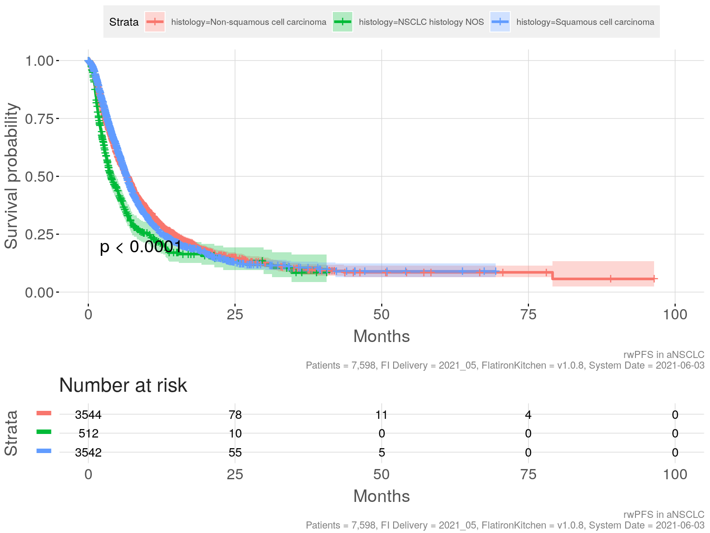
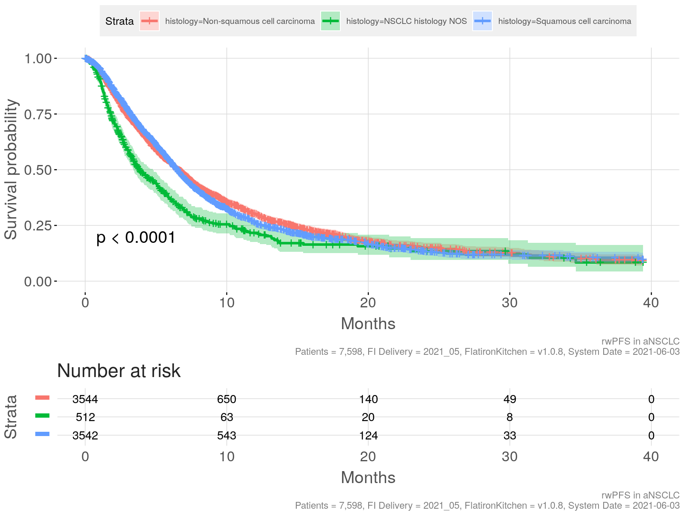

# realworldPFS package

Calculate & compare a range of real-world PFS endpoint definitions from
Flatiron and other real-world data sources

Installation:

    devtools::install_git("https://github.roche.com/RWDScodeshare/realworldPFS")

   

\*\*Note that the vignette below is currently written for
FlatironKitchen and needs to be updated. FlatironKitchen imports the
present *realworldPFS* package and provides wrappers around
`add_progression`, `calc_rwPFS` and `compare_rwPFS` functions, called
`fi_add_progression`, `fi_calc_rwPFS`, and `fi_compare_rwPFS`,
respectively. For details on how the use of *realworldPFS* functions
differs from the *FlatironKitchen* wrappers please consult
`?<function_name>`.

   

**Feel free to skip the background section if just looking for how to
use the software - if conducting an actual analysis, we recommend to
read it in order to understand the pitfalls of using rwPFS**

   

# Background on rwPFS

Progression-free Survival (PFS) is a commonly used time-to event
endpoint in cancer trials. It is defined as the first event of either
death or progression, whichever occurs first.

An important difference between PFS and Overall Survival (OS) endpoints
is that PFS requires close follow-up of patients, whereas OS does not.
This is because death is a one-time event, and whenever a patient is
contacted alive, we know that death had not occurred previously. This is
not the case when looking at progression, hence patients must be closely
monitored.

 

**The mechanisms of data-collection differ between real-world data &
clinical trials (Mhatre 2021):**

-   In clinical trials, tumor assessments are commonly scheduled at
    regular intervals, and progression is assessed using standardized
    criteria. The reason for collecting PFS data in clinical trials is
    commonly to measure efficacy. Transparency and consistency of the
    data collection process is emphasized.

-   In routine health care, there is no protocol and hence no scheduled
    tumor assessments nor standardized criteria for assessing
    progression. Physicians may primarily measure progression in order
    to make treatment decisions, not to measure effectiveness. In
    addition, transparency and consistency of data collection are likely
    to be less important objectives than cost considerations or
    minimization of discomfort for the patient (e.g. by avoiding
    unnecessary scans).

 

Because of these differences, it appears sensible to speak of
“real-world PFS” (**rwPFS**) and to treat it as distinct from trial PFS.

However, due to the highly similar definitions of rwPFS and PFS, it is
possible that the two endpoints may be *exchangeable*, meaning they
essentially lead to the same result and could be used to compare
effectivness of treatments both within a particular real-world data
source as well as between trial and real-world data.

 

> Whether or not **PFS** and **rwPFS** endpoints are **exchangeable**
> and can be used for comparing drug efficacy across two data sets
> (real-world and clinical trial) may depend on indication, drug
> category, real-world database, and other factors. While attempts
> should be made to understand and ensure quality of data collection in
> the real-world data, this will likely never be perfect. Consequently,
> empirical confirmation of exchangeability of rwPFS and PFS will be
> needed. This can be done by replicating trial arms and comparing rwPFS
> and trial PFS outcomes (Mhatre 2021; Ton 2021), across indications and
> drug categories.

 

## Publications assessing exchangeability of rwPFS and trial PFS

The following publications assess exchangeability of rwPFS and PFS:

-   Ton (2021) : aNSCLC chemotherapy

-   Mhatre (2021) (in preparation): aNSCLC chemotherapy and
    immunotherapy

Please help complete this list by [suggesting additional
articles](https://github.roche.com/RWDScodeshare/FlatironKitchen/issues/new)

## Algorithm for calculating rwPFS using Flatiron data

The schematic below illustrates the important elements required for
calculating a rwPFS endpoint:

-   the start date (baseline)

-   ‘lastclinicnotedate,’ the date up to which progression was
    abstracted from clinical notes

-   the dates of any progression events of interest (may be a subset of
    events)

-   the date of death, if present

-   the date of a patient’s last structured activity in the database

-   the presence of potential visit gaps (not shown), indicating that
    the patient may not have been followed for progression due to
    prolonged absence from the clinic in the Flatiron network
    (e.g. &gt;90d).

-   a time window after the end of progression follow-up where death
    events are to be captured. This is required because patients often
    leave the Flatiron network shortly before dying. If the time window
    is too small, there will almost exclusively be progression events.
    If the window is too large, more deaths are captured, but at the
    same time the risk of missing any progression events increases.
    Therefore, a pragmatic choice in the middle will have to be made.
    More on this point later.

   

   

> **A general algorithm for calculation of rwPFS consists of the
> following steps:**
>
> 1.  **Determine the period of continuous progression follow-up.**
>
>     It begins at baseline and ends at one of the following, whichever
>     occurs first:
>
>     -   the start of a long gap between visits (e.g. &gt;90d)
>
>     -   the date of last progression abstraction
>         (‘lastclinicnotedate’)
>
>     -   the date of last structured activity in the database
>
> 2.  **Determine the type of rwPFS event**, in this order:
>
>     -   “Progression,” if an event occurs during the follow-up period
>
>     -   “Death,” if it occurs within the specified time window after
>         end of follow-up
>
>     -   “Censoring” otherwise
>
> 3.  **Create rwPFS variables **
>
>     -   record a rwPFS event in case of death or progression event
>         types
>
>     -   otherwise, censor the patient at the end of progression
>         follow-up
>
>     -   calculate the time from baseline to event or censoring

## There are several possible rwPFS definitions

**Multiple possible definitions of rwPFS can be specified based on the
elements mentioned above:**

-   **different subsets of progression events in Flatiron’s
    *progression* table could be used**, e.g. only radiographically
    confirmed progression events, or only progression events that occur
    more than 14 days after baseline (as per Flatiron recommendation)

-   **different possibilities exist to handle changes in the line of
    therapy (LoT):** one could either

    -   follow the patient for progression into a subsequent LoT if no
        progression has occurred, or..

    -   censor the patient at the start of a subsequent LoT, or..

    -   impute a progression event at the start of a subsequent LoT
        (following the clinical logic that LoT is anchored to
        progression)

-   **different choices are possible for the length of the time window
    to capture death events**

    -   the aim is to capture most of - and only - the death events
        correlated in time with the end of follow-up.

    -   this is reminiscent of informative censoring - except events
        after the *end of follow-up* can be assessed and potentially
        included.

    -   reasonable values for the length of the time window can be
        argued based on comparison with data collection in trials, or -
        in a data-driven way - by inspecting the drop in death events as
        the window is being extended (see best practices below). For a
        detailed discussion see Mhatre (2021)

    -   ultimately, any choice will remain arbitrary to some extent.

-   it seems reasonable to ensure gapless progression follow-up, but
    **the choice of a maximally tolerable gap length between visits
    remains arbitrary**. A commonly used value is 90 days, however,
    without a very strong rationale.

## Best practices to support the emergence of consensus definitions

As outlined above, there is a range of possible definitions of rwPFS. To
determine which of these are most closely mimicking clinical trial PFS
requires discussions with subject matter experts, and it is possible
that different conclusions may be reached depending on cancer type,
indication, drug category, analysis objective, or other factors. From
our experience in aNSCLC (Mhatre 2021; Ton 2021) several definitions -
not only one - remain viable options even after discussion with experts,
and eventually a pragmatic choice must be made. Despite a desire for
standardization, we reached the conclusion that defining a single
standard is not helpful given the current state of knowledge, and that
instead we should promote best practices that support the emergence of -
preferably rather few - standard definitions via publications in the
scientific literature.

 

To promote the emergence of standard rwPFS definitions and comparability
across analyses we propose the following best practices:    

> **Proposed best practices when using rwPFS**
>
> 1.  Check if there is already a commonly used rwPFS definition in
>     analyses similar to yours.
>
> 2.  Discuss sensible rwPFS definitions with subject matter experts.
>
> 3.  If there is already a commonly used rwPFS definition that passes
>     the expert test, try to use it.
>
> 4.  If you have reasons to use a different definition, do so and try
>     to explain your choice
>
> 5.  **Be transparent about the exact definition you’re using**
>
> 6.  **Explore a range of sensible alternative definitions and report
>     key descriptors to show how rwPFS definition affects the
>     conclusions of the analysis**

   

# The basics: adding rwPFS

To start, we will add a rwPFS variable to our FlatironKitchen dataset.
For simplicity, we will use the rwPFS definition used in Mhatre (2021)
and Ton (2021):

-   **Use all progression events except where “pseudoprogression
    mentioned”** (not only events based on radiographic evidence, and we
    don’t discard progression events occurring within 2 weeks after
    baseline)

-   **Follow patients for progression into subsequent lines of
    treatment** (do not censor them at start of new line, do not impute
    progression at line change)

-   **Include death events occurring &lt;30d after end of progression
    follow-up**

-   **Censor individuals if there is a visit gap &gt; 90 days during
    follow-up**

-   **Use the first progression event when there are several**

## Setup

1.  Load the required libraries

<!-- -->

    library(dplyr)
    library(FlatironKitchen)

Here is the version of `FlatironKitchen` used in this vignette.

    packageVersion("FlatironKitchen")
    #> [1] '1.0.8'

1.  Create a FlatironKitchen object, using the advanced Non Small-cell
    Lung Cancer datamart

<!-- -->

    fk <- fi_start(
      datamart = "AdvancedNSCLC",
      title = "rwPFS in aNSCLC"
    ) 

1.  Add information on the 1st line of therapy (note we’re also getting
    info on the 2nd line for later..)

<!-- -->

    fk <- fk %>%  
      fi_add_lineoftherapy_flatiron(
        lines = c(1,2),
        index_date = "advanceddiagnosisdate",
        left = 0,
        right = 90,
        calc_duration = FALSE
      ) 

1.  We will look at the rwPFS in patients that receive Carboplatin &
    Paclitaxel in first line

<!-- -->

    fk <- fk %>%  
      fi_cohort_include(
        lot1linename == "Carboplatin,Paclitaxel", 
        description = "Carboplatin & Paclitaxel in 1st line", 
        keep_na = FALSE
      ) 

Let’s a have a quick look at the cohort we’ve just selected:

    print(fk)
    #> Project 
    #> $title          :  rwPFS in aNSCLC 
    #> $datamart       :  AdvancedNSCLC 
    #> $version        :  1.0.8 'Tiramisu'
    #> $year_month     :  2021_05 'May 2021'
    #> 
    #> Patients 
    #> $n              :  7,907 Patients 
    #> $col_names      :  34 [..., lot2startdate, lot2enddate]
    #> 
    #> Attrition 
    #> AdvancedNSCLC                       :  69,869 ----------------------------------------
    #> Carboplatin & Paclitaxel in 1st lin :   7,907 ----
    #> 
    #> Warnings 
    #> -  508 (0.7%) patients appear in at least one other enhanced cohort. 
    #> -  16 (0%) patient(s) had DateOfDeath values unlike YYYY-MM and will b...

These are the variables we currently have in our data:

    fk$data %>% names
    #>  [1] "patientid"             "diagnosisdate"         "advanceddiagnosisdate" "histology"             "groupstage"           
    #>  [6] "smokingstatus"         "multiple"              "practiceid"            "practicetype"          "primaryphysicianid"   
    #> [11] "birthyear"             "gender"                "race"                  "ethnicity"             "state"                
    #> [16] "region"                "raceethnicity"         "dateofdeath"           "death"                 "lastvisitdate"        
    #> [21] "lastadmindate"         "lastlabdate"           "lastvitalsdate"        "enddate"               "lastactivitydate"     
    #> [26] "lastcontactdate"       "lot1linename"          "lot1linecategory"      "lot1startdate"         "lot1enddate"          
    #> [31] "lot2linename"          "lot2linecategory"      "lot2startdate"         "lot2enddate"

Note that several variables required for the calculation of rwPFS are
already present.

These are “lot1startdate” (our baseline), lastactivitydate and
dateofdeath.

What’s still missing for the calculation of rwPFS (besides progression),
is information on any long gaps between visits, so let’s do this

1.  Add information on visit gaps larger than 90 days from start of 1st
    line onwards

<!-- -->

    fk <- fk %>%  
      fi_calc_visitgap(
        index_date = "lot1startdate",
        gapdays = 90,
        what = "After",
        force_database = FALSE
      )

This is required to ensure gapless progression follow-up. The function
added a few columns related to the visit gap, of which we only need the
date of the “lastvisitbeforegap.”

## Add information on progression

1.  add the date of the first progression event and end date of
    progression abstraction (“lastclinicnotedate”)

Selecting the subset of progression events to use is the first step of
specifying a rwPFS definition. Here we stick to the definition outlined
above, using all progression events, radiographic or not, and we don’t
discard any events occuring right after baseline. We do exclude events
that are flagged “ispseudoprogressionmentioned,” though. Incidentally,
there won’t be any pseudoprogression events in chemotherapies such as
the Carboplatin & Paclitaxel combination (you could check the number of
events to verify). Here we’re simply sticking to the definition proposed
by Mhatre (2021) for use across both CIT and chemotherapies in aNSCLC,
based on the OAK trial (see Mhatre (2021) for details).

    fk <- fk %>% 
      fi_add_progression(
          start_date = "lot1startdate",          #we're measuring rwPFS from the start of treatment
          require_radiographic = FALSE,          #we don't require progression to be radiographically confirmed (in NSCLC, most are anyway)
          exclude_pseudoprogression = TRUE,      #we exclude pseudoprogression events (there won't be any in our chemo treatment)
          discard_n_days = 0,                    #we do not discard any progression events right after baseline              
          label = "_nopseudo",                   #this (optional) label will help us keep different rwPFS endpoints apart later
          prog_filter_expression = NULL          #this is an advanced feature allowing more flexible event selection, explained later. Defaults to NULL.
      )
    #> 
    #> ── fi_add_progression() ────────────────────────────────────────────────────── 
    #> Note    : Adding first progression event after lot1startdate, discarding events within the first 0 days. Require_radiographic: FALSE. Exclude_pseudoprogression: TRUE. Label: "_nopseudo". Expression for additional filtering of progression events: none.
    #> Touching: ENHANCED_ADVNSCLCPROGRESSION
    #> Joining, by = "patientid"
    #> Warning : 292 patient(s) had no progression information abstracted beyond startdate (lastclinicnotedate set to missing)
    #> NewCols : progressiondate_nopseudo, lastclinicnotedate_nopseudo
    #> Time    : 6.7s [65.9 s]

Two new columns were added: *progressiondate\_nopseudo* and
*lastclinicnotedate\_nopseudo*

Note that FlatironKitchen warned us that 287 out of our 7,823 patients
had no progression abstracted beyond the baseline date. This can happen
if patients had no progression information abstracted at all, or their
lastclinicnotedate is before our startdate. At this point we could
exclude those patients since it won’t be possible to calculate rwPFS for
them. However, let’s leave them for now, in order to demonstrate how the
downstream functions deal with such cases.

## Habemus real-world PFS!

Not yet - but soon. Now that all required columns are present in our
dataset, we can..

1.  Compute the rwPFS endpoint

<!-- -->

    fk <- fk %>% 
      fi_calc_rwPFS(
        start_date = "lot1startdate",                          #we're measuring rwPFS from the start of treatment
        visit_gap_start_date = "lastvisitbeforegap",           #the start date of any gap in visits longer than 90 days
        last_clinic_note_date = "lastclinicnotedate_nopseudo", #the lastclinicnotedate we just added..
        progression_date = "progressiondate_nopseudo",         #..and the progression date with the same label
        last_activity_date = "lastactivitydate",               #the date of last activity in the database
        death_date = "dateofdeath",
        death_window_days = 30,                                #include death events up to 30d after end of progression follow-up
        max_follow_up_days = Inf,                              #censor patients after a maximum time (e.g. to harmonize with the trial). Defaults to Inf.
        label = "_no_pseudoprogression"                        #let this be our primary rwPFS definition, the reference to compare others against
      )
    #> 
    #> ── fi_add_rwPFS() ──────────────────────────────────────────────────────────── 
    #> Note    : Adding first rwPFS event after lot1startdate, including death events occurring up to 30d after end of progression follow-up. Label: _no_pseudoprogression.
    #> Warning : The rwPFS variables for  309 patient(s) were set to missing. This could be due to one of the following reasons: missing lastclinicnotedate, missing date of last activity,  lastclinicnotedate equal to the startdate, or a date of death being earlier than the start date (this can happen because death dates are rounded to mid-month in Flatiron).  These could be either removed from the data, or manually censored at baseline (to preserve the distribution of baseline covariates)
    #> NewCols : rwpfs_no_pseudoprogression_eof_date, rwpfs_no_pseudoprogression_event_type, rwpfs_no_pseudoprogression_date, rwpfs_no_pseudoprogression_days, rwpfs_no_pseudoprogression_event, rwpfs_no_pseudoprogression_months
    #> Time    : 0s [66 s]

Note the warning about some patients having been set to missing. Let’s
have a closer look at those.

    fk$data %>% 
      filter(rwpfs_no_pseudoprogression_event_type == "Missing") %>% 
      count(
        `missing lastclinicnotedate` = is.na(lastclinicnotedate_nopseudo), 
        `lastclinicnotedate on start date?` = lot1startdate == lastclinicnotedate_nopseudo,
        `missing last activity date?` = is.na(lastactivitydate),
        `death before start date` = dateofdeath <= lot1startdate
      ) %>%
      knitr::kable() 

<table style="width:100%;">
<colgroup>
<col style="width: 23%" />
<col style="width: 29%" />
<col style="width: 23%" />
<col style="width: 20%" />
<col style="width: 3%" />
</colgroup>
<thead>
<tr class="header">
<th style="text-align: left;">missing lastclinicnotedate</th>
<th style="text-align: left;">lastclinicnotedate on start date?</th>
<th style="text-align: left;">missing last activity date?</th>
<th style="text-align: left;">death before start date</th>
<th style="text-align: right;">n</th>
</tr>
</thead>
<tbody>
<tr class="odd">
<td style="text-align: left;">FALSE</td>
<td style="text-align: left;">FALSE</td>
<td style="text-align: left;">FALSE</td>
<td style="text-align: left;">TRUE</td>
<td style="text-align: right;">17</td>
</tr>
<tr class="even">
<td style="text-align: left;">TRUE</td>
<td style="text-align: left;">NA</td>
<td style="text-align: left;">FALSE</td>
<td style="text-align: left;">FALSE</td>
<td style="text-align: right;">202</td>
</tr>
<tr class="odd">
<td style="text-align: left;">TRUE</td>
<td style="text-align: left;">NA</td>
<td style="text-align: left;">FALSE</td>
<td style="text-align: left;">TRUE</td>
<td style="text-align: right;">26</td>
</tr>
<tr class="even">
<td style="text-align: left;">TRUE</td>
<td style="text-align: left;">NA</td>
<td style="text-align: left;">FALSE</td>
<td style="text-align: left;">NA</td>
<td style="text-align: right;">64</td>
</tr>
</tbody>
</table>

It looks like a total of 278 patients had a missing lastclinicnote date
(this may have been so from the start, or fi\_add\_progression may have
set this to missing in case it was before the start date). The
fi\_add\_progression function had already alerted us about this. An
additional 17 patients seem to have their death dates before start date,
which is likely due to the monthly granularity of death dates in
Flatiron (for de-identification purposes). Let us remove patients with
missing rwPFS.

    fk <- fk %>%
      fi_cohort_exclude(rwPFS_no_pseudoprogression_event_type == "Missing",
                        description = "Exclude missing rwPFS",
                        keep_na = FALSE
      )
    #> 
    #> ── fi_cohort_exclude() ─────────────────────────────────────────────────────── 
    #> Note    : Description = Exclude missing rwPFS
    #> Note    : Code = rwPFS_no_pseudoprogression_event_type == "Missing"
    #> Excluded: 309 patients
    #> Cohort  : 7,598 patients
    #> Time    : 0s [66 s]

Finally, let’s plot the Kaplan-Meier curve for rwPFS, stratified by
histology.

    fk %>%
      fi_stat_survfit(
        followup_duration = "rwpfs_no_pseudoprogression_months",
        status = "rwpfs_no_pseudoprogression_event",
        strata = "histology"
      ) %>%
      fi_plot_km(
        xlab = "Months"
      )

This doesn’t look too bad - except that the different histologies have
very different follow-up times, it seems. Let’s re-generate those rwPFS
variables, but this time right-censor patients with respect to rwPFS at
around 40 months - let’s say 1200 days.

    fk <- fk %>% 
      fi_select(-contains("rwpfs")) %>%                        #FK doesn't let us overwrite columns, lots remove the old ones first.. 
      fi_calc_rwPFS(
        start_date = "lot1startdate",                          
        visit_gap_start_date = "lastvisitbeforegap",           
        last_clinic_note_date = "lastclinicnotedate_nopseudo", 
        progression_date = "progressiondate_nopseudo",        
        last_activity_date = "lastactivitydate",               
        death_date = "dateofdeath",
        death_window_days = 30,                                
        max_follow_up_days = 1200,                             
        label = "_no_pseudoprogression"                                  
      ) 
    #> Time    : 0s [66 s]
    #> 
    #> ── fi_add_rwPFS() ──────────────────────────────────────────────────────────── 
    #> Note    : Adding first rwPFS event after lot1startdate, including death events occurring up to 30d after end of progression follow-up. Label: _no_pseudoprogression.
    #> NewCols : rwpfs_no_pseudoprogression_eof_date, rwpfs_no_pseudoprogression_event_type, rwpfs_no_pseudoprogression_date, rwpfs_no_pseudoprogression_days, rwpfs_no_pseudoprogression_event, rwpfs_no_pseudoprogression_months
    #> Time    : 0.1s [66.1 s]

..and plot it again

    fk %>%
      fi_stat_survfit(
        followup_duration = "rwpfs_no_pseudoprogression_months",
        status = "rwpfs_no_pseudoprogression_event",
        strata = "histology"
      ) %>%
      fi_plot_km(
        xlab = "Months"
      )

This looks much cleaner. Congratulations, you’ve mastered the basics of
using rwPFS!

   

# Advanced: comparison of multiple rwPFS definitions

As mentioned before, there is more than one way of defining rwPFS.
Often, the differences between definitions will be small - but
nevertheless, we need to show this, we can’t just assume they are, and
we must be able to answer questions in that direction.. However,
conducting a full sensitivity analysis for each and every rwPFS
definition seems overkill.. so what do we do?

 

Ideally, we’d have a concise summary table, where readers could verify
at one glance what the impact of varying the endpoint definition would
be. This is what we’ll try to do..

 

First, let’s calculate rwPFS across a range of “reasonable” definitions,
starting with the progression part & varying one aspect at a time,
always comparing against our reference progression variable defined
previously.

 

    fk <- fk %>%
      
      #do not remove pseudoprogression events
      fi_add_progression(
        start_date = "lot1startdate",          
        require_radiographic = FALSE,          #we don't require progression to be radiographically confirmed (in NSCLC, most are anyway)
        exclude_pseudoprogression = FALSE,     #we don't exclude pseudoprogression events (there won't be any in our chemo treatment)
        discard_n_days = 0,                    #we do not discard any progression events right after baseline              
        label = "_allevents",                  
        prog_filter_expression = NULL          
      ) %>%
      
      #omit progression events occurring within 14d of baseline (Flatiron guidance)
      fi_add_progression(
        start_date = "lot1startdate",          
        require_radiographic = FALSE,          #we don't require progression to be radiographically confirmed (in NSCLC, most are anyway)
        exclude_pseudoprogression = TRUE,      #we exclude pseudoprogression events (there won't be any in our chemo treatment)
        discard_n_days = 14,                   #we discard any progression events within 14d after baseline              
        label = "_omit_le_14d",                
        prog_filter_expression = NULL         
      ) %>%
      
      #only use radiographically confirmed progression events
      fi_add_progression(
        start_date = "lot1startdate",          
        require_radiographic = TRUE,           #we require progression to be radiographically confirmed (in NSCLC, most are anyway)
        exclude_pseudoprogression = TRUE,      #we exclude pseudoprogression events (there won't be any in our chemo treatment)
        discard_n_days = 0,                    #we don't discard progression events shortly after baseline              
        label = "_only_radiographic",          
        prog_filter_expression = NULL   
      ) 
    #> 
    #> ── fi_add_progression() ────────────────────────────────────────────────────── 
    #> Note    : Adding first progression event after lot1startdate, discarding events within the first 0 days. Require_radiographic: FALSE. Exclude_pseudoprogression: FALSE. Label: "_allevents". Expression for additional filtering of progression events: none.
    #> Touching: ENHANCED_ADVNSCLCPROGRESSION
    #> Joining, by = "patientid"
    #> NewCols : progressiondate_allevents, lastclinicnotedate_allevents
    #> Time    : 7.4s [73.4 s]
    #> 
    #> ── fi_add_progression() ────────────────────────────────────────────────────── 
    #> Note    : Adding first progression event after lot1startdate, discarding events within the first 14 days. Require_radiographic: FALSE. Exclude_pseudoprogression: TRUE. Label: "_omit_le_14d". Expression for additional filtering of progression events: none.
    #> Touching: ENHANCED_ADVNSCLCPROGRESSION
    #> Joining, by = "patientid"
    #> NewCols : progressiondate_omit_le_14d, lastclinicnotedate_omit_le_14d
    #> Time    : 7.2s [80.6 s]
    #> 
    #> ── fi_add_progression() ────────────────────────────────────────────────────── 
    #> Note    : Adding first progression event after lot1startdate, discarding events within the first 0 days. Require_radiographic: TRUE. Exclude_pseudoprogression: TRUE. Label: "_only_radiographic". Expression for additional filtering of progression events: none.
    #> Touching: ENHANCED_ADVNSCLCPROGRESSION
    #> Joining, by = "patientid"
    #> NewCols : progressiondate_only_radiographic, lastclinicnotedate_only_radiographic
    #> Time    : 7.8s [88.4 s]

 

We also want to look at rwPFS definitions where

-   a progression event is imputed at the start of the next LoT

-   patients are censored at start of the next Lot

-   we don’t consider visit gaps

 

We already have the start date of the 2nd LoT from before. What we need
is the date of those imputed progression events, and a columns that
replaces the lastclinicnotedate with the start date of LoT 2 if it’s
before lastclinicnotedate..

 

    fk <- fk %>%
      fi_mutate(
        #impute progression at start of 2nd line
        imputed_progression_date = pmin(progressiondate_nopseudo, lot2startdate, na.rm = T),
        #censor at the earliest of lastclinicnotedate or start of 2nd line
        imputed_censoring_date = pmin(lastclinicnotedate_nopseudo, lot2startdate, na.rm = T),
        #adding an all_na column because fi_calc_rwPFS expects the start date of any long visit gaps - we'll tell it there are none..
        all_na = NA_character_ %>% as.Date()
      )
    #> NewCols : imputed_progression_date, imputed_censoring_date, all_na
    #> Time    : 0s [88.4 s]

 

Now, we can calculate the different rwPFS endpoints corresponding to the
above handling of progression events and LoT:

 

    fk <- fk %>% 
      
       #all events
       fi_calc_rwPFS(
        start_date = "lot1startdate",                           
        visit_gap_start_date = "lastvisitbeforegap",            
        last_clinic_note_date = "lastclinicnotedate_allevents",
        progression_date = "progressiondate_allevents",         
        last_activity_date = "lastactivitydate",               
        death_date = "dateofdeath",
        death_window_days = 30,                                 
        max_follow_up_days = 1200,                              
        label = "_all_events"                                   
      )  %>%
      
      #omit events within 14d of baseline
      fi_calc_rwPFS(
        start_date = "lot1startdate",                          
        visit_gap_start_date = "lastvisitbeforegap",          
        last_clinic_note_date = "lastclinicnotedate_omit_le_14d", 
        progression_date = "progressiondate_omit_le_14d",         
        last_activity_date = "lastactivitydate",               
        death_date = "dateofdeath",
        death_window_days = 30,                                
        max_follow_up_days = 1200,                             
        label = "_omit_le_14d"                                
      ) %>%
      
      #only use radiographically confirmed progression events
      fi_calc_rwPFS(
        start_date = "lot1startdate",                          
        visit_gap_start_date = "lastvisitbeforegap",           
        last_clinic_note_date = "lastclinicnotedate_only_radiographic", 
        progression_date = "progressiondate_only_radiographic", 
        last_activity_date = "lastactivitydate",               
        death_date = "dateofdeath",
        death_window_days = 30,                                
        max_follow_up_days = 1200,                             
        label = "_only_radiographic"                           
      )   %>%
      
      #impute progression at start of 2nd line
      fi_calc_rwPFS(
        start_date = "lot1startdate",                          
        visit_gap_start_date = "lastvisitbeforegap",           
        last_clinic_note_date = "lastclinicnotedate_nopseudo", 
        progression_date = "imputed_progression_date",        
        last_activity_date = "lastactivitydate",               
        death_date = "dateofdeath",
        death_window_days = 30,                                
        max_follow_up_days = 1200,                             
        label = "_impute_progression"                          
      ) %>%
      
      #censor at the earliest of lastclinicnotedate or start of 2nd line
      fi_calc_rwPFS(
        start_date = "lot1startdate",                          
        visit_gap_start_date = "lastvisitbeforegap",           
        last_clinic_note_date = "imputed_censoring_date",      
        progression_date = "progressiondate_nopseudo",         
        last_activity_date = "lastactivitydate",               
        death_date = "dateofdeath",
        death_window_days = 30,                                
        max_follow_up_days = 1200,                             
        label = "_censor_at_lot_change"                        
      ) %>%
      
      #Ignore visit gaps
      fi_calc_rwPFS(
        start_date = "lot1startdate",                          
        visit_gap_start_date = "all_na",                       
        last_clinic_note_date = "lastclinicnotedate_nopseudo", 
        progression_date = "progressiondate_nopseudo",        
        last_activity_date = "lastactivitydate",               
        death_date = "dateofdeath",
        death_window_days = 30,                                
        max_follow_up_days = 1200,                             
        label = "_ignore_visit_gaps"                           
      ) 
    #> 
    #> ── fi_add_rwPFS() ──────────────────────────────────────────────────────────── 
    #> Note    : Adding first rwPFS event after lot1startdate, including death events occurring up to 30d after end of progression follow-up. Label: _all_events.
    #> NewCols : rwpfs_all_events_eof_date, rwpfs_all_events_event_type, rwpfs_all_events_date, rwpfs_all_events_days, rwpfs_all_events_event, rwpfs_all_events_months
    #> Time    : 0.1s [88.5 s]
    #> 
    #> ── fi_add_rwPFS() ──────────────────────────────────────────────────────────── 
    #> Note    : Adding first rwPFS event after lot1startdate, including death events occurring up to 30d after end of progression follow-up. Label: _omit_le_14d.
    #> NewCols : rwpfs_omit_le_14d_eof_date, rwpfs_omit_le_14d_event_type, rwpfs_omit_le_14d_date, rwpfs_omit_le_14d_days, rwpfs_omit_le_14d_event, rwpfs_omit_le_14d_months
    #> Time    : 0.1s [88.5 s]
    #> 
    #> ── fi_add_rwPFS() ──────────────────────────────────────────────────────────── 
    #> Note    : Adding first rwPFS event after lot1startdate, including death events occurring up to 30d after end of progression follow-up. Label: _only_radiographic.
    #> NewCols : rwpfs_only_radiographic_eof_date, rwpfs_only_radiographic_event_type, rwpfs_only_radiographic_date, rwpfs_only_radiographic_days, rwpfs_only_radiographic_event, rwpfs_only_radiographic_months
    #> Time    : 0.1s [88.6 s]
    #> 
    #> ── fi_add_rwPFS() ──────────────────────────────────────────────────────────── 
    #> Note    : Adding first rwPFS event after lot1startdate, including death events occurring up to 30d after end of progression follow-up. Label: _impute_progression.
    #> NewCols : rwpfs_impute_progression_eof_date, rwpfs_impute_progression_event_type, rwpfs_impute_progression_date, rwpfs_impute_progression_days, rwpfs_impute_progression_event, rwpfs_impute_progression_months
    #> Time    : 0.1s [88.6 s]
    #> 
    #> ── fi_add_rwPFS() ──────────────────────────────────────────────────────────── 
    #> Note    : Adding first rwPFS event after lot1startdate, including death events occurring up to 30d after end of progression follow-up. Label: _censor_at_lot_change.
    #> NewCols : rwpfs_censor_at_lot_change_eof_date, rwpfs_censor_at_lot_change_event_type, rwpfs_censor_at_lot_change_date, rwpfs_censor_at_lot_change_days, rwpfs_censor_at_lot_change_event, rwpfs_censor_at_lot_change_months
    #> Time    : 0.1s [88.7 s]
    #> 
    #> ── fi_add_rwPFS() ──────────────────────────────────────────────────────────── 
    #> Note    : Adding first rwPFS event after lot1startdate, including death events occurring up to 30d after end of progression follow-up. Label: _ignore_visit_gaps.
    #> NewCols : rwpfs_ignore_visit_gaps_eof_date, rwpfs_ignore_visit_gaps_event_type, rwpfs_ignore_visit_gaps_date, rwpfs_ignore_visit_gaps_days, rwpfs_ignore_visit_gaps_event, rwpfs_ignore_visit_gaps_months
    #> Time    : 0.1s [88.7 s]

 

Now that we have all these different rwPFS endpoints, let’s compare them
using `fi_compare_rwPFS`:

 

    fk %>% 
      fi_compare_rwPFS(
        labels = c(                         #Specify the rwPFS labels to be tabulated (in the desired order)
          "_no_pseudoprogression",
          "_all_events",
          "_omit_le_14d",
          "_only_radiographic",
          "_impute_progression",
          "_censor_at_lot_change",
          "_ignore_visit_gaps"
        ),
        reference = "_no_pseudoprogression",
        incremental_deaths_column = FALSE 
      ) %>%
      kable()
    #> 
    #> ── fi_compare_rwpfs() ──────────────────────────────────────────────────────── 
    #> Note    : Comparing rwPFS definitions with the following labels: _no_pseudoprogression, _all_events, _omit_le_14d, _only_radiographic, _impute_progression, _censor_at_lot_change, _ignore_visit_gaps

<table>
<colgroup>
<col style="width: 21%" />
<col style="width: 10%" />
<col style="width: 12%" />
<col style="width: 6%" />
<col style="width: 14%" />
<col style="width: 17%" />
<col style="width: 17%" />
</colgroup>
<thead>
<tr class="header">
<th style="text-align: left;">rwPFS definition</th>
<th style="text-align: right;">Censoring</th>
<th style="text-align: right;">Progression</th>
<th style="text-align: right;">Death</th>
<th style="text-align: right;">Percent death</th>
<th style="text-align: left;">KM median</th>
<th style="text-align: left;">Hazard ratio</th>
</tr>
</thead>
<tbody>
<tr class="odd">
<td style="text-align: left;">No pseudoprogression</td>
<td style="text-align: right;">3155</td>
<td style="text-align: right;">3343</td>
<td style="text-align: right;">1100</td>
<td style="text-align: right;">24.8</td>
<td style="text-align: left;">6.37 (6.18-6.57)</td>
<td style="text-align: left;">1 (reference)</td>
</tr>
<tr class="even">
<td style="text-align: left;">All events</td>
<td style="text-align: right;">3143</td>
<td style="text-align: right;">3360</td>
<td style="text-align: right;">1095</td>
<td style="text-align: right;">24.6</td>
<td style="text-align: left;">6.28 (6.14-6.54)</td>
<td style="text-align: left;">1.01 (0.96-1.05)</td>
</tr>
<tr class="odd">
<td style="text-align: left;">Omit le 14d</td>
<td style="text-align: right;">3173</td>
<td style="text-align: right;">3310</td>
<td style="text-align: right;">1115</td>
<td style="text-align: right;">25.2</td>
<td style="text-align: left;">6.41 (6.18-6.6)</td>
<td style="text-align: left;">0.99 (0.95-1.04)</td>
</tr>
<tr class="even">
<td style="text-align: left;">Only radiographic</td>
<td style="text-align: right;">3191</td>
<td style="text-align: right;">3274</td>
<td style="text-align: right;">1133</td>
<td style="text-align: right;">25.7</td>
<td style="text-align: left;">6.44 (6.24-6.67)</td>
<td style="text-align: left;">0.99 (0.95-1.03)</td>
</tr>
<tr class="odd">
<td style="text-align: left;">Impute progression</td>
<td style="text-align: right;">2719</td>
<td style="text-align: right;">3924</td>
<td style="text-align: right;">955</td>
<td style="text-align: right;">19.6</td>
<td style="text-align: left;">4.67 (4.53-4.83)</td>
<td style="text-align: left;">1.31 (1.26-1.37)</td>
</tr>
<tr class="even">
<td style="text-align: left;">Censor at lot change</td>
<td style="text-align: right;">3921</td>
<td style="text-align: right;">2701</td>
<td style="text-align: right;">976</td>
<td style="text-align: right;">26.5</td>
<td style="text-align: left;">6.34 (6.14-6.57)</td>
<td style="text-align: left;">0.99 (0.95-1.04)</td>
</tr>
<tr class="odd">
<td style="text-align: left;">Ignore visit gaps</td>
<td style="text-align: right;">2526</td>
<td style="text-align: right;">3930</td>
<td style="text-align: right;">1142</td>
<td style="text-align: right;">22.5</td>
<td style="text-align: left;">6.64 (6.41-6.9)</td>
<td style="text-align: left;">0.93 (0.89-0.97)</td>
</tr>
</tbody>
</table>

 

The obtained table gives an overview across the rwPFS definitions we’re
considering. It compares the no. of patients censored, with progression,
or dying, as well as the percentage of rwPFS events (death and
progression combined) that are death.

Kaplan-Meier median and hazard ratio relative to the reference
definition give an impression of how big the impact on corresponding
analysis outcomes would be. Note that to obtain the hazard ratio, a cox
regression was fitted to data of twice the same patients but with
different endpoints. Since the Cox model assumes the data from two
compared groups to be independent, this is a bit of a stretch. The HR
should therefore cautiously be interpreted as a crude indication of
expected impact on any HR analyses, in order to avoid doing full
senstivity analyses with all rwPFS definitions.

Glancing at HR’s across all definitions, we find that in most cases,
hazard ratios should be little affected by the exact rwPFS definition,
with two exceptions: imputing progression increases the event rate
considerably, and not ensuring continuous progression follow-up slightly
reduces the event rate, presumably due to progression events going
missing.

With ‘imputing progression’ having the strongest impact, arguing for
this definition would require strong evidence that there is a
substantial amount of missing information in the progression data, and
that line-change would be a reliable indicator of progression. We
consider this not to be the case and conclude that imputing progression
at line change is not to be recommended.

Not ensuring continuous follow-up by not censoring patients at the start
of any visit gap of 90d or longer decreases the event rate, which
suggests that indeed the progression information in patients with long
gaps is incomplete. Consequently, we consider it reasonable to censor
patients at the start of any long gaps, as is done in the reference
definition.

Apart from ‘Ignore visit gaps’ and ‘Impute progression,’ all tested
definitions appear sensible and differ very little in terms of hazard
ratios or median rwPFS.

 

A remaining question is how long the time window for capturing deaths
should be, after the end of progression follow-up. We’ve chosen 30 days
above, but mostly because that’s what Mhatre (2021) and Ton (2021) did.

 

There may not be one single “right” value for the size of this window.
However, one way of verifying if a given value is sensible is to vary
the length of this window and check how many additional deaths are
captured when extending it. The idea here is that we want to capture
most of the deaths that are correlated with the end of progression
follow-up, meaning they happen shortly after. In addition, we want to
keep the window as small as possible to avoid missing any progression
events. A pragmatic choice may be made that reconciles these opposing
objectives as well as possible.

   
We can calculate rwPFS endpoints with varying window lengths as follows:

 

    fk <- fk %>%
      
      #removing all previous rwPFS columns
      fi_select(-contains("rwpfs")) %>%     
      
      fi_calc_rwPFS(
        start_date = "lot1startdate",                          
        visit_gap_start_date = "lastvisitbeforegap",           
        last_clinic_note_date = "lastclinicnotedate_nopseudo",
        progression_date = "progressiondate_nopseudo",         
        last_activity_date = "lastactivitydate",               
        death_date = "dateofdeath",
        death_window_days = 0,                                
        max_follow_up_days = 1200,                             
        label = "_0d_window"                                   
      ) %>%
      
      fi_calc_rwPFS(
        start_date = "lot1startdate",                          
        visit_gap_start_date = "lastvisitbeforegap",           
        last_clinic_note_date = "lastclinicnotedate_nopseudo",
        progression_date = "progressiondate_nopseudo",         
        last_activity_date = "lastactivitydate",               
        death_date = "dateofdeath",
        death_window_days = 10,                                
        max_follow_up_days = 1200,                             
        label = "_10d_window"                                   
      ) %>%
      
      fi_calc_rwPFS(
        start_date = "lot1startdate",                          
        visit_gap_start_date = "lastvisitbeforegap",           
        last_clinic_note_date = "lastclinicnotedate_nopseudo",
        progression_date = "progressiondate_nopseudo",         
        last_activity_date = "lastactivitydate",               
        death_date = "dateofdeath",
        death_window_days = 20,                                
        max_follow_up_days = 1200,                             
        label = "_20d_window"                                   
      ) %>%
      
      fi_calc_rwPFS(
        start_date = "lot1startdate",                          
        visit_gap_start_date = "lastvisitbeforegap",           
        last_clinic_note_date = "lastclinicnotedate_nopseudo",
        progression_date = "progressiondate_nopseudo",         
        last_activity_date = "lastactivitydate",               
        death_date = "dateofdeath",
        death_window_days = 30,                                
        max_follow_up_days = 1200,                             
        label = "_30d_window"                                   
      ) %>%
      
      fi_calc_rwPFS(
        start_date = "lot1startdate",                          
        visit_gap_start_date = "lastvisitbeforegap",           
        last_clinic_note_date = "lastclinicnotedate_nopseudo",
        progression_date = "progressiondate_nopseudo",         
        last_activity_date = "lastactivitydate",               
        death_date = "dateofdeath",
        death_window_days = 40,                                
        max_follow_up_days = 1200,                             
        label = "_40d_window"                                   
      ) %>%
      
      fi_calc_rwPFS(
        start_date = "lot1startdate",                          
        visit_gap_start_date = "lastvisitbeforegap",           
        last_clinic_note_date = "lastclinicnotedate_nopseudo",
        progression_date = "progressiondate_nopseudo",         
        last_activity_date = "lastactivitydate",               
        death_date = "dateofdeath",
        death_window_days = 50,                                
        max_follow_up_days = 1200,                             
        label = "_50d_window"                                   
      ) %>%
      
      fi_calc_rwPFS(
        start_date = "lot1startdate",                          
        visit_gap_start_date = "lastvisitbeforegap",           
        last_clinic_note_date = "lastclinicnotedate_nopseudo",
        progression_date = "progressiondate_nopseudo",         
        last_activity_date = "lastactivitydate",               
        death_date = "dateofdeath",
        death_window_days = 60,                                
        max_follow_up_days = 1200,                             
        label = "_60d_window"                                   
      ) %>%
      
      fi_calc_rwPFS(
        start_date = "lot1startdate",                          
        visit_gap_start_date = "lastvisitbeforegap",           
        last_clinic_note_date = "lastclinicnotedate_nopseudo",
        progression_date = "progressiondate_nopseudo",         
        last_activity_date = "lastactivitydate",               
        death_date = "dateofdeath",
        death_window_days = 70,                                
        max_follow_up_days = 1200,                             
        label = "_70d_window"                                   
      ) %>%
      
      fi_calc_rwPFS(
        start_date = "lot1startdate",                          
        visit_gap_start_date = "lastvisitbeforegap",           
        last_clinic_note_date = "lastclinicnotedate_nopseudo",
        progression_date = "progressiondate_nopseudo",         
        last_activity_date = "lastactivitydate",               
        death_date = "dateofdeath",
        death_window_days = 80,                                
        max_follow_up_days = 1200,                             
        label = "_80d_window"                                   
      ) %>%
      
      fi_calc_rwPFS(
        start_date = "lot1startdate",                          
        visit_gap_start_date = "lastvisitbeforegap",           
        last_clinic_note_date = "lastclinicnotedate_nopseudo",
        progression_date = "progressiondate_nopseudo",         
        last_activity_date = "lastactivitydate",               
        death_date = "dateofdeath",
        death_window_days = 90,                                
        max_follow_up_days = 1200,                             
        label = "_90d_window"                                   
      ) 
    #> Time    : 0s [88.7 s]
    #> 
    #> ── fi_add_rwPFS() ──────────────────────────────────────────────────────────── 
    #> Note    : Adding first rwPFS event after lot1startdate, including death events occurring up to 0d after end of progression follow-up. Label: _0d_window.
    #> NewCols : rwpfs_0d_window_eof_date, rwpfs_0d_window_event_type, rwpfs_0d_window_date, rwpfs_0d_window_days, rwpfs_0d_window_event, rwpfs_0d_window_months
    #> Time    : 0s [88.8 s]
    #> 
    #> ── fi_add_rwPFS() ──────────────────────────────────────────────────────────── 
    #> Note    : Adding first rwPFS event after lot1startdate, including death events occurring up to 10d after end of progression follow-up. Label: _10d_window.
    #> NewCols : rwpfs_10d_window_eof_date, rwpfs_10d_window_event_type, rwpfs_10d_window_date, rwpfs_10d_window_days, rwpfs_10d_window_event, rwpfs_10d_window_months
    #> Time    : 0s [88.8 s]
    #> 
    #> ── fi_add_rwPFS() ──────────────────────────────────────────────────────────── 
    #> Note    : Adding first rwPFS event after lot1startdate, including death events occurring up to 20d after end of progression follow-up. Label: _20d_window.
    #> NewCols : rwpfs_20d_window_eof_date, rwpfs_20d_window_event_type, rwpfs_20d_window_date, rwpfs_20d_window_days, rwpfs_20d_window_event, rwpfs_20d_window_months
    #> Time    : 0s [88.9 s]
    #> 
    #> ── fi_add_rwPFS() ──────────────────────────────────────────────────────────── 
    #> Note    : Adding first rwPFS event after lot1startdate, including death events occurring up to 30d after end of progression follow-up. Label: _30d_window.
    #> NewCols : rwpfs_30d_window_eof_date, rwpfs_30d_window_event_type, rwpfs_30d_window_date, rwpfs_30d_window_days, rwpfs_30d_window_event, rwpfs_30d_window_months
    #> Time    : 0.1s [88.9 s]
    #> 
    #> ── fi_add_rwPFS() ──────────────────────────────────────────────────────────── 
    #> Note    : Adding first rwPFS event after lot1startdate, including death events occurring up to 40d after end of progression follow-up. Label: _40d_window.
    #> NewCols : rwpfs_40d_window_eof_date, rwpfs_40d_window_event_type, rwpfs_40d_window_date, rwpfs_40d_window_days, rwpfs_40d_window_event, rwpfs_40d_window_months
    #> Time    : 0.1s [89 s]
    #> 
    #> ── fi_add_rwPFS() ──────────────────────────────────────────────────────────── 
    #> Note    : Adding first rwPFS event after lot1startdate, including death events occurring up to 50d after end of progression follow-up. Label: _50d_window.
    #> NewCols : rwpfs_50d_window_eof_date, rwpfs_50d_window_event_type, rwpfs_50d_window_date, rwpfs_50d_window_days, rwpfs_50d_window_event, rwpfs_50d_window_months
    #> Time    : 0.1s [89 s]
    #> 
    #> ── fi_add_rwPFS() ──────────────────────────────────────────────────────────── 
    #> Note    : Adding first rwPFS event after lot1startdate, including death events occurring up to 60d after end of progression follow-up. Label: _60d_window.
    #> NewCols : rwpfs_60d_window_eof_date, rwpfs_60d_window_event_type, rwpfs_60d_window_date, rwpfs_60d_window_days, rwpfs_60d_window_event, rwpfs_60d_window_months
    #> Time    : 0s [89.1 s]
    #> 
    #> ── fi_add_rwPFS() ──────────────────────────────────────────────────────────── 
    #> Note    : Adding first rwPFS event after lot1startdate, including death events occurring up to 70d after end of progression follow-up. Label: _70d_window.
    #> NewCols : rwpfs_70d_window_eof_date, rwpfs_70d_window_event_type, rwpfs_70d_window_date, rwpfs_70d_window_days, rwpfs_70d_window_event, rwpfs_70d_window_months
    #> Time    : 0s [89.1 s]
    #> 
    #> ── fi_add_rwPFS() ──────────────────────────────────────────────────────────── 
    #> Note    : Adding first rwPFS event after lot1startdate, including death events occurring up to 80d after end of progression follow-up. Label: _80d_window.
    #> NewCols : rwpfs_80d_window_eof_date, rwpfs_80d_window_event_type, rwpfs_80d_window_date, rwpfs_80d_window_days, rwpfs_80d_window_event, rwpfs_80d_window_months
    #> Time    : 0s [89.2 s]
    #> 
    #> ── fi_add_rwPFS() ──────────────────────────────────────────────────────────── 
    #> Note    : Adding first rwPFS event after lot1startdate, including death events occurring up to 90d after end of progression follow-up. Label: _90d_window.
    #> NewCols : rwpfs_90d_window_eof_date, rwpfs_90d_window_event_type, rwpfs_90d_window_date, rwpfs_90d_window_days, rwpfs_90d_window_event, rwpfs_90d_window_months
    #> Time    : 0.1s [89.2 s]

 

and then compare them like before, but this time adding an ‘incremental
deaths’ column to the output, indicating how many additional deaths are
captured by extending the window by 10 more days

 

    fk %>% 
      fi_compare_rwPFS(
        labels = paste0("_", 0:9*10, "d_window"),                         #Specify the rwPFS labels to be tabulated (in the desired order)
        reference = "_30d_window",
        incremental_deaths_column = TRUE 
      ) %>%
      kable()
    #> 
    #> ── fi_compare_rwpfs() ──────────────────────────────────────────────────────── 
    #> Note    : Comparing rwPFS definitions with the following labels: _0d_window, _10d_window, _20d_window, _30d_window, _40d_window, _50d_window, _60d_window, _70d_window, _80d_window, _90d_window

<table>
<colgroup>
<col style="width: 15%" />
<col style="width: 8%" />
<col style="width: 10%" />
<col style="width: 5%" />
<col style="width: 16%" />
<col style="width: 12%" />
<col style="width: 15%" />
<col style="width: 15%" />
</colgroup>
<thead>
<tr class="header">
<th style="text-align: left;">rwPFS definition</th>
<th style="text-align: right;">Censoring</th>
<th style="text-align: right;">Progression</th>
<th style="text-align: right;">Death</th>
<th style="text-align: right;">Incremental deaths</th>
<th style="text-align: right;">Percent death</th>
<th style="text-align: left;">KM median</th>
<th style="text-align: left;">Hazard ratio</th>
</tr>
</thead>
<tbody>
<tr class="odd">
<td style="text-align: left;">0d window</td>
<td style="text-align: right;">4091</td>
<td style="text-align: right;">3343</td>
<td style="text-align: right;">164</td>
<td style="text-align: right;">NA</td>
<td style="text-align: right;">4.7</td>
<td style="text-align: left;">7.66 (7.46-7.95)</td>
<td style="text-align: left;">0.8 (0.76-0.83)</td>
</tr>
<tr class="even">
<td style="text-align: left;">10d window</td>
<td style="text-align: right;">3809</td>
<td style="text-align: right;">3343</td>
<td style="text-align: right;">446</td>
<td style="text-align: right;">282</td>
<td style="text-align: right;">11.8</td>
<td style="text-align: left;">7.29 (7.03-7.49)</td>
<td style="text-align: left;">0.86 (0.82-0.9)</td>
</tr>
<tr class="odd">
<td style="text-align: left;">20d window</td>
<td style="text-align: right;">3458</td>
<td style="text-align: right;">3343</td>
<td style="text-align: right;">797</td>
<td style="text-align: right;">351</td>
<td style="text-align: right;">19.3</td>
<td style="text-align: left;">6.8 (6.57-7)</td>
<td style="text-align: left;">0.94 (0.9-0.98)</td>
</tr>
<tr class="even">
<td style="text-align: left;">30d window</td>
<td style="text-align: right;">3155</td>
<td style="text-align: right;">3343</td>
<td style="text-align: right;">1100</td>
<td style="text-align: right;">303</td>
<td style="text-align: right;">24.8</td>
<td style="text-align: left;">6.37 (6.18-6.57)</td>
<td style="text-align: left;">1 (reference)</td>
</tr>
<tr class="odd">
<td style="text-align: left;">40d window</td>
<td style="text-align: right;">2946</td>
<td style="text-align: right;">3343</td>
<td style="text-align: right;">1309</td>
<td style="text-align: right;">209</td>
<td style="text-align: right;">28.1</td>
<td style="text-align: left;">6.14 (5.95-6.28)</td>
<td style="text-align: left;">1.04 (1-1.08)</td>
</tr>
<tr class="even">
<td style="text-align: left;">50d window</td>
<td style="text-align: right;">2798</td>
<td style="text-align: right;">3343</td>
<td style="text-align: right;">1457</td>
<td style="text-align: right;">148</td>
<td style="text-align: right;">30.4</td>
<td style="text-align: left;">5.98 (5.78-6.18)</td>
<td style="text-align: left;">1.07 (1.03-1.11)</td>
</tr>
<tr class="odd">
<td style="text-align: left;">60d window</td>
<td style="text-align: right;">2694</td>
<td style="text-align: right;">3343</td>
<td style="text-align: right;">1561</td>
<td style="text-align: right;">104</td>
<td style="text-align: right;">31.8</td>
<td style="text-align: left;">5.88 (5.68-6.05)</td>
<td style="text-align: left;">1.09 (1.04-1.13)</td>
</tr>
<tr class="even">
<td style="text-align: left;">70d window</td>
<td style="text-align: right;">2622</td>
<td style="text-align: right;">3343</td>
<td style="text-align: right;">1633</td>
<td style="text-align: right;">72</td>
<td style="text-align: right;">32.8</td>
<td style="text-align: left;">5.85 (5.62-6.01)</td>
<td style="text-align: left;">1.1 (1.05-1.14)</td>
</tr>
<tr class="odd">
<td style="text-align: left;">80d window</td>
<td style="text-align: right;">2556</td>
<td style="text-align: right;">3343</td>
<td style="text-align: right;">1699</td>
<td style="text-align: right;">66</td>
<td style="text-align: right;">33.7</td>
<td style="text-align: left;">5.75 (5.55-5.98)</td>
<td style="text-align: left;">1.11 (1.06-1.15)</td>
</tr>
<tr class="even">
<td style="text-align: left;">90d window</td>
<td style="text-align: right;">2510</td>
<td style="text-align: right;">3343</td>
<td style="text-align: right;">1745</td>
<td style="text-align: right;">46</td>
<td style="text-align: right;">34.3</td>
<td style="text-align: left;">5.75 (5.55-5.95)</td>
<td style="text-align: left;">1.11 (1.07-1.16)</td>
</tr>
</tbody>
</table>

 

Similarly as before, we are now able to compare different rwPFS
definitions at a glance and examine the impact of extending the time
window for capturing death events.

 

First, a time-window of 0 days corresponds to a reasonably substantial
HR difference of 0.2 compared to the reference (30d window). This
indicates that indeed it is important to capture death events occuring
after end of progression follow-up. We can also see, that the effect of
extending the window from 30d to 90d changes the HR by 0.11, suggesting
that the effect of extending the window further is diminishing rapidly.
This is reflected in the ‘Incremental deaths’ column as well: for the
each 10-day period up to 30 days we capture approximately 300 more
deaths, with this number dropping rapidly thereafter. It is hard to tell
where exactly the cutoff should be made - but it looks like 30d to 60d
is reasonable since most censoring-related deaths appear to be captured,
and further extension has negligible impact on hazard ratios.

 

# rwPFS in cancers other than aNSCLC, and custom filtering of progression events

 

The above examples all used the aNSCLC datamart - how can rwPFS be
calculated for other datamarts?

 

There are three points to consider:

-   `fi_calc_rwPFS` and `fi_compare_rwPFS` can be used in exactly the
    same way as illustrated above.

-   Which rwPFS definitions are most appropriate must be determined
    individually for other patient populations.

-   `fi_add_progression` makes assumptions about the structure of the
    `PROGRESSION` table in the Flatiron database, which may complicate
    its use with certain datamarts. However, the function can be tweaked
    by using the `prog_filter_expression` argument. With it, a logical R
    expression (involving unquoted table column names) can be supplied,
    and only progression events are included where this expression
    evaluates to “TRUE.” This can also be used for more fine-grained
    filtering of progression events in the aNSCLC datamart.

 

For a start, let’s look what the `PROGRESSION` table looks like in the
aNSCLC datamart

 

    fk %>%
      fi_read_table(
        table_name = "ENHANCED_ADVNSCLCPROGRESSION"
      ) %>%
      head() 
    #> # Source:   lazy query [?? x 8]
    #> # Database: postgres [bretscm2@redshift-01-eu.dap.apollo.roche.com:5439/flatiron_edm]
    #>   patientid   progressiondate isradiographicevi… ispathologicevid… isclinicalassessm… ismixedresponse ispseudoprogressio… lastclinicnoted…
    #>   <chr>       <date>          <chr>              <chr>             <chr>              <chr>           <chr>               <date>          
    #> 1 F00E506E3B… 2014-10-13      Yes                No                No                 No              No                  2016-02-15      
    #> 2 F00E506E3B… 2014-12-08      Yes                No                No                 No              No                  2016-02-15      
    #> 3 F00E506E3B… 2015-04-06      Yes                No                No                 No              No                  2016-02-15      
    #> 4 F00E506E3B… 2015-08-03      Yes                No                No                 No              No                  2016-02-15      
    #> 5 F00E66FFD0… 2013-03-26      No                 No                Yes                No              No                  2013-04-24      
    #> 6 F00E714103… NA              <NA>               <NA>              <NA>               <NA>            <NA>                2015-07-24

 

Knowing the structure of the progression table, we can now select
radiographically confirmed progression events that are not
pseudoprogression using the `prog_filter_expression` argument - which
yields the same result as what we get by using the
`require_radiographic` and `exclude_pseudoprogression` arguments.

 

    fk <- fk %>%
      #remove previously generated columns
      fi_select( 
        -contains("progressiondate"), 
        -contains("lastclinicnotedate"), 
        -contains("rwpfs")
      ) %>%
      
      #This is how we filtered progression events before
      fi_add_progression(
          start_date = "lot1startdate",          
          require_radiographic = TRUE,          
          exclude_pseudoprogression = TRUE,      
          discard_n_days = 0,                   
          label = "_radio_nopseudo",                  
          prog_filter_expression = NULL          
      ) %>%
      
      
      #This is the same using prog_filter_expression instead
      fi_add_progression(
          start_date = "lot1startdate",          
          require_radiographic = FALSE,          #These are now not used      
          exclude_pseudoprogression = FALSE,     #These are now not used
          discard_n_days = 0,                   
          label = "_prog_filter_expression",                  
          prog_filter_expression = "isradiographicevidence == 'Yes' &  ispseudoprogressionmentioned == 'No'"     
      )
    #> Time    : 0s [89.2 s]
    #> 
    #> ── fi_add_progression() ────────────────────────────────────────────────────── 
    #> Note    : Adding first progression event after lot1startdate, discarding events within the first 0 days. Require_radiographic: TRUE. Exclude_pseudoprogression: TRUE. Label: "_radio_nopseudo". Expression for additional filtering of progression events: none.
    #> Touching: ENHANCED_ADVNSCLCPROGRESSION
    #> Joining, by = "patientid"
    #> NewCols : progressiondate_radio_nopseudo, lastclinicnotedate_radio_nopseudo
    #> Time    : 6.8s [96 s]
    #> 
    #> ── fi_add_progression() ────────────────────────────────────────────────────── 
    #> Note    : Adding first progression event after lot1startdate, discarding events within the first 0 days. Require_radiographic: FALSE. Exclude_pseudoprogression: FALSE. Label: "_prog_filter_expression". Expression for additional filtering of progression events: "isradiographicevidence == 'Yes' &  ispseudoprogressionmentioned == 'No'"
    #> Touching: ENHANCED_ADVNSCLCPROGRESSION
    #> Joining, by = "patientid"
    #> NewCols : progressiondate_prog_filter_expression, lastclinicnotedate_prog_filter_expression
    #> Time    : 6.9s [103 s]
      
      #This is to demonstrate that the two ways are exactly equivalent
      fk %>%
        fi_pull_data() %>%
        {
          all(.$progressiondate_radio_nopseudo == .$progressiondate_prog_filter_expression)
        }
    #> [1] TRUE

   
As we can see, the two ways of filtering progression events are
equivalent.  

Note: require\_radiographic or exclude\_pseudoprogression arguments
generate filter expressions that are simply concatenated with
prog\_filter\_expression using logical `AND`.

 

To do this in Metastatic breastcancer, we run

 

    fk2 <- fi_start("MetastaticBreastCancer")
    #> 
    #> ── fi_connect() ────────────────────────────────────────────────────────────── 
    #> Note    : Connecting to database 'flatiron_edm' on server 'redshift-01-eu.dap.apollo.roche.com'
    #> 
    #> ── fi_create() ─────────────────────────────────────────────────────────────── 
    #> Note    : FlatironKitchen  v1.0.8 'Tiramisu'
    #> Argument: title = 'bretscm2's 2021-06-03 MetastaticBreastCancer kitchen'
    #> Note    : Using the latest Flatiron delivery: May-21
    #> Argument: year_month = '2021_05'
    #> 
    #> ── fi_cohort_start() ───────────────────────────────────────────────────────── 
    #> Touching: ENHANCED_METASTATICBREAST
    #> Warning : 906 (3.5%) patients appear in at least one other enhanced cohort.
    #> Cohort  : 25,562 patients
    #> NewCols : patientid, diagnosisdate, metdiagnosisdate, groupstage, multiple
    #> Time    : 0.9s [0.9 s]
    #> 
    #> ── fi_add_demographics() ───────────────────────────────────────────────────── 
    #> Touching: DEMOGRAPHICS
    #> NewCols : practiceid, practicetype, primaryphysicianid, birthyear, gender, race, ethnicity, state
    #> Time    : 0.3s [1.2 s]
    #> 
    #> ── fi_calc_region() ────────────────────────────────────────────────────────── 
    #> Note    : Using State -> Region mapping = 'phc'
    #> NewCols : region
    #> Time    : 0s [1.2 s]
    #> 
    #> ── fi_calc_raceethnicity() ─────────────────────────────────────────────────── 
    #> NewCols : raceethnicity
    #> Time    : 0s [1.2 s]
    #> 
    #> ── fi_add_mortality() ──────────────────────────────────────────────────────── 
    #> Argument: impute_method = '15'
    #> Touching: ENHANCED_MORTALITY
    #> Warning : 11 (0.1%) patient(s) had DateOfDeath values unlike YYYY-MM and will be set to missing
    #> NewCols : dateofdeath
    #> Time    : 0.2s [1.4 s]
    #> 
    #> ── fi_calc_death() ─────────────────────────────────────────────────────────── 
    #> Argument: method = 'non_miss_dod'
    #> NewCols : death
    #> Time    : 0s [1.4 s]
    #> 
    #> ── fi_add_lastdates() ──────────────────────────────────────────────────────── 
    #> Touching: VISIT
    #> Touching: MEDICATIONADMINISTRATION
    #> Touching: LAB
    #> Touching: VITALS
    #> NewCols : lastvisitdate, lastadmindate, lastlabdate, lastvitalsdate
    #> Time    : 1s [2.4 s]
    #> 
    #> ── fi_calc_lastactivity_date() ─────────────────────────────────────────────── 
    #> Note    : lastactivitydate = max(lastvisitdate, lastadmindate, lastlabdate, lastvitalsdate, enddate)
    #> NewCols : enddate, lastactivitydate
    #> Time    : 0.2s [2.6 s]
    #> 
    #> ── fi_calc_lastcontact_date() ──────────────────────────────────────────────── 
    #> Note    : lastcontactdate = max(dateofdeath, lastvisitdate, lastadmindate, lastlabdate, lastvitalsdate)
    #> NewCols : lastcontactdate
    #> Time    : 0s [2.7 s]

    fk2 %>%
      fi_read_table(table_name = "ENHANCED_METBREASTPROGRESSION") %>%
       head() 
    #> # Source:   lazy query [?? x 10]
    #> # Database: postgres [bretscm2@redshift-01-eu.dap.apollo.roche.com:5439/flatiron_edm]
    #>   patientid progressiondate isradiographice… ispathologicevi… isclinicalasses… isphysicalexame… istumormarkerso… ismixedresponse
    #>   <chr>     <date>          <chr>            <chr>            <chr>            <chr>            <chr>            <chr>          
    #> 1 F0FC5E32… 2019-05-21      Yes              No               No               No               No               No             
    #> 2 F0FC5E32… 2019-08-12      Yes              Yes              No               No               No               No             
    #> 3 F0FC5E32… 2019-12-13      Yes              No               No               No               No               No             
    #> 4 F0FC5E32… 2020-02-01      Yes              No               No               No               No               No             
    #> 5 F0FC5E32… 2020-06-17      Yes              No               No               No               No               No             
    #> 6 F0FC60A7… 2016-06-17      Yes              No               No               No               No               No             
    #> # … with 2 more variables: ispseudoprogressionmentioned <chr>, lastclinicnotedate <date>

 

This progression table has additional columns/flags while containing the
`ispseudoprogressionmentioned` and `isradiographicevidence` columns
we’ve seen in the aNSCLC progression table. All these can be used
jointly to filter progression events, for example

 

    fk2 <- fk2 %>%
      fi_add_progression(
        start_date = "metdiagnosisdate",
        require_radiographic = FALSE,
        exclude_pseudoprogression = TRUE,
        discard_n_days = 0,
        label = "",
        prog_filter_expression = "istumormarkersonly == 'No'"
      )
    #> 
    #> ── fi_add_progression() ────────────────────────────────────────────────────── 
    #> Note    : Adding first progression event after metdiagnosisdate, discarding events within the first 0 days. Require_radiographic: FALSE. Exclude_pseudoprogression: TRUE. Label: none. Expression for additional filtering of progression events: "istumormarkersonly == 'No'"
    #> Touching: ENHANCED_METBREASTPROGRESSION
    #> Joining, by = "patientid"
    #> Warning : 3097 patient(s) had no progression information abstracted beyond startdate (lastclinicnotedate set to missing)
    #> NewCols : progressiondate, lastclinicnotedate
    #> Time    : 28.2s [30.9 s]

 

In this manner we can use `fi_add_progression` with any progression
table that has a `progressiondate` and a `lastclinicnotedate` column.

 

# References

Mhatre. 2021. “Replicating Progression-Free Survival in the OAK Trial
Using Real-World Data.” *In Preparation*.

Ton. 2021. “Replication of Overall Survival, Progression Free Survival
and Response in Chemotherapy Arms of First Line Non-Small Cell Lung
Cancer Trials Using Real-World Data External Controls.” *In
Preparation*.
